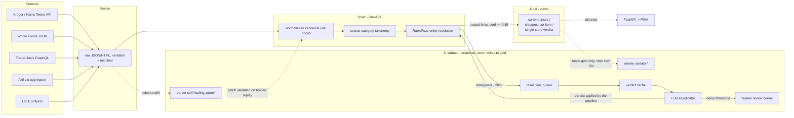
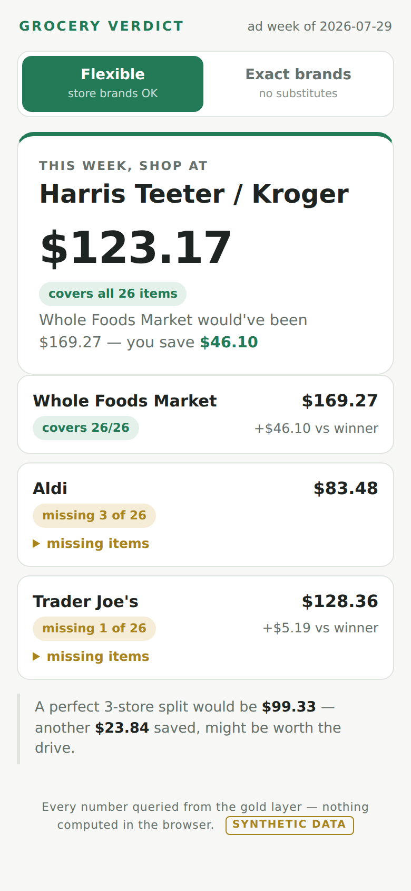
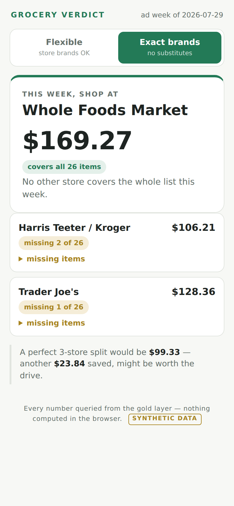
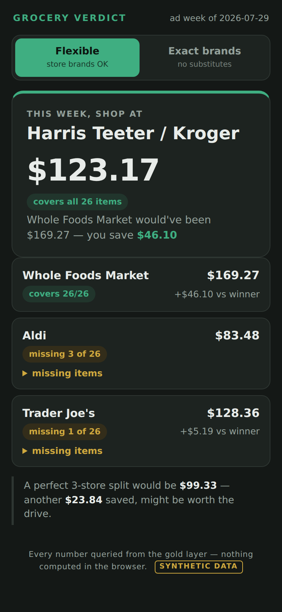

# Grocery Basket Optimizer

A DC-metro grocery price optimization pipeline. Ingests weekly prices/deals from
multiple chains (Giant, Safeway, Harris Teeter, Whole Foods, Aldi, Lidl),
normalizes disparate sources into canonical products, and recommends the cheapest
store split for a predicted weekly basket.

Lightweight medallion architecture on **DuckDB + files + Task Scheduler** — no
Spark, no orchestration framework, no vector store. Runs natively on Windows.

- **Bronze** — raw timestamped fetch responses saved to disk verbatim (the time
  machine; weekly ads expire). DuckDB holds a manifest of every artifact.
- **Silver** — parsed, normalized records: canonical products, canonical unit
  prices, per-source confidence, entity resolution.
- **Gold** — query-facing views: cheapest source per canonical item this week,
  and (later) basket optimization output.

The deterministic pipeline is the sole source of truth. Agents assist judgment
and narrate results — they never write directly to gold.

## Architecture

The LLM proposes; the pipeline disposes. LLMs sit at three judgment points, each
behind a deterministic gate — they return verdicts and proposals, and only the
pipeline writes. Gold reads cached verdicts, never live LLM output, so every run
replays identically. A full annotated diagram lives at
[`docs/architecture.html`](docs/architecture.html); the flow in brief:



\* planned — see the build order in `CLAUDE.md`.

## The verdict PWA

One screen, one answer: which single store wins your whole list this week.
Mobile-first, installable to a phone home screen, served on the local network
from FastAPI — the frontend renders gold-layer query results and never computes
a price itself. The exact-brands / flexible toggle is driven by entity-match
confidence scores, so the two modes can genuinely disagree (below: flexible
picks Harris Teeter at $123.17; exact brands drops its two store-brand
substitutes and Whole Foods becomes the only full-coverage store).

| Flexible (store brands OK) | Exact brands | Dark theme |
| :---: | :---: | :---: |
|  |  |  |

All numbers shown are from the seeded synthetic demo dataset
(`grocery-seed-demo`) — realistic invented prices, no harvested data.

## Quickstart

```powershell
uv venv
uv pip install -e ".[dev]"

# Build (or refresh) the DuckDB schema
uv run grocery-init-db

# Run tests
uv run pytest

# Try the whole thing with synthetic data (no credentials needed)
uv run grocery-seed-demo   # seed 4 stores x 26 items of demo prices
uv run grocery-serve       # verdict PWA at http://localhost:8177
```

Then copy `.env.example` to `.env` and fill in credentials as you build out the
fetchers.

## Layout

```
src/grocery_optimizer/
  config.py     paths + .env loading
  db.py         connection + schema init
  sql/          bronze / silver / gold DDL
  bronze/       fetchers (Kroger, Whole Foods, Trader Joe's, Aldi/KCL, Lidl)
  silver/       normalization, taxonomy, entity resolution, adjudicator, verdict
  gold/         query helpers
  scripts/      entry points
docs/           architecture diagram
```

See `CLAUDE.md` for the full project spec and build order.
