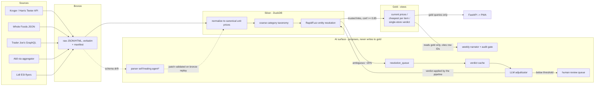
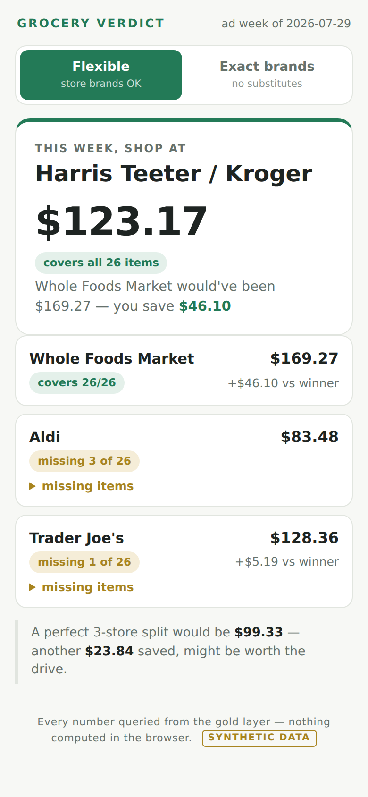
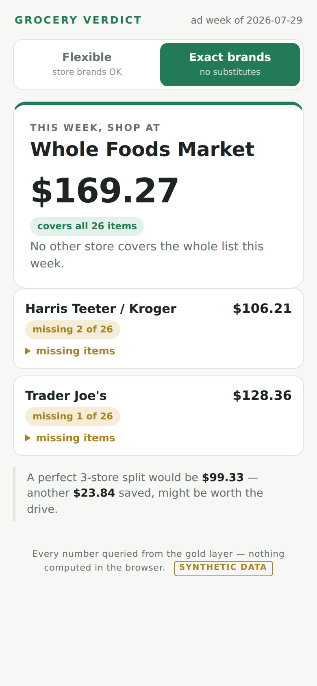
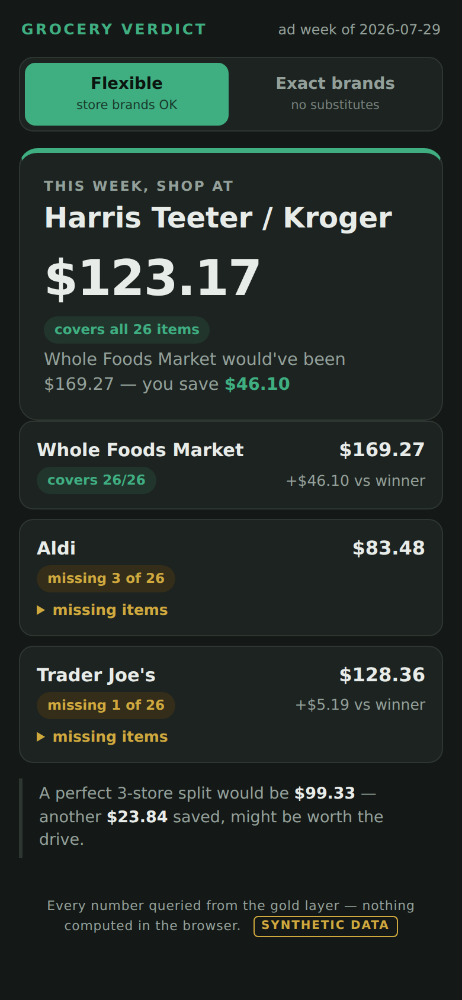

# Grocery Basket Optimizer

[](https://github.com/hemangnagar/grocery_optimizer/actions/workflows/ci.yml)
[](LICENSE)

A DC-metro grocery price optimization pipeline. Ingests weekly prices/deals from
multiple chains (Giant, Safeway, Harris Teeter, Whole Foods, Aldi, Lidl),
normalizes disparate sources into canonical products, and recommends the cheapest
store split for a predicted weekly basket.

Lightweight medallion architecture on **DuckDB + files + Task Scheduler** — no
Spark, no orchestration framework, no vector store. Runs natively on Windows.

- **Bronze** — raw timestamped fetch responses saved to disk verbatim (the time
  machine; weekly ads expire). DuckDB holds a manifest of every artifact.
- **Silver** — parsed, normalized records: canonical products, canonical unit
  prices, per-source confidence, entity resolution.
- **Gold** — query-facing views: cheapest source per canonical item this week,
  and (later) basket optimization output.

The deterministic pipeline is the sole source of truth. Agents assist judgment
and narrate results — they never write directly to gold.

## Architecture

The LLM proposes; the pipeline disposes. LLMs sit at three judgment points, each
behind a deterministic gate — they return verdicts and proposals, and only the
pipeline writes. Gold reads cached verdicts, never live LLM output, so every run
replays identically. A full annotated diagram lives at
[`docs/architecture.html`](docs/architecture.html); the flow in brief:


```mermaid
flowchart LR
    subgraph SRC [Sources]
        K[Kroger / Harris Teeter API]
        W[Whole Foods JSON]
        T[Trader Joe's GraphQL]
        A[Aldi via aggregator]
        L[Lidl ESI flyers]
    end
    subgraph BR [Bronze]
        R[raw JSON/HTML, verbatim
        + manifest]
    end
    subgraph SV [Silver - DuckDB]
        N[normalize to canonical unit prices]
        X[coarse category taxonomy]
        E[RapidFuzz entity resolution]
    end
    subgraph GD [Gold - views]
        G[current prices /
        cheapest per item /
        single-store verdict]
    end
    K --> R
    W --> R
    T --> R
    A --> R
    L --> R
    R --> N --> X --> E
    E -->|trusted links, conf >= 0.85| G
    G -->|gold queries only| F[FastAPI -> PWA]

    subgraph AI [AI surface - proposes, never writes to gold]
        Q[resolution_queue] --> C[verdict cache] --> J[LLM adjudicator]
        J -->|below threshold| H[human review queue]
        P[parser self-healing agent*]
        NR[weekly narrator + audit gate]
    end
    E -->|ambiguous ~20%| Q
    J -->|verdict applied by the pipeline| E
    R -.->|schema drift| P
    P -.->|patch validated on bronze replay| N
    G -->|reads gold only, cites row IDs| NR
```

\* the self-healing agent proposes a patched parser on schema drift, but a
patch is promoted only if it reproduces the current parser byte-for-byte on
the last known-good bronze artifact — the same "LLM proposes, pipeline
disposes" gate as everything else.

## The verdict PWA

One screen, one answer: which single store wins your whole list this week.
Mobile-first, installable to a phone home screen, served on the local network
from FastAPI — the frontend renders gold-layer query results and never computes
a price itself. Stores beyond a configurable radius of home are excluded in
gold (haversine over chain-locator coordinates), and each store card carries a
distance chip. The exact-brands / flexible toggle is driven by entity-match
confidence scores, so the two modes can genuinely disagree (below: flexible
picks Harris Teeter at $123.17; exact brands drops its two store-brand
substitutes and Whole Foods becomes the only full-coverage store).

| Flexible (store brands OK) | Exact brands | Dark theme |
| :---: | :---: | :---: |
|  |  |  |

All numbers shown are from the seeded synthetic demo dataset
(`grocery-seed-demo`) — realistic invented prices, no harvested data.

> **A note on data.** This repo is the machinery, not the moat. The demo
> dataset is synthetic; the production system runs against a growing private
> archive of DC-metro weekly price history (weekly ads expire and are
> unrecoverable — the bronze layer is a time machine) and an adjudicated
> product-matching verdict library that compounds with every run. Neither
> ships here. If that part interests you, ask me about it.

## Quickstart

```powershell
uv venv
uv pip install -e ".[dev]"

# Build (or refresh) the DuckDB schema
uv run grocery-init-db

# Run tests
uv run pytest

# Try the whole thing with synthetic data (no credentials needed)
uv run grocery-seed-demo   # seed 4 stores x 26 items of demo prices
uv run grocery-serve       # verdict PWA at http://localhost:8177
```

Then copy `.env.example` to `.env` and fill in credentials as you build out the
fetchers. For real data, the whole weekly ingest is one command —
`uv run grocery-weekly-pull` — and `ops/register_weekly_pull.ps1` registers it
as a Tuesday-night Windows Task Scheduler job (ads refresh Wednesdays).

## Data contract &amp; lineage

The gold layer's promise to its consumers is written down as an
[Open Data Contract Standard](https://bitol.io/) (ODCS v3) contract —
[`contracts/gold_current_prices.odcs.yaml`](contracts/gold_current_prices.odcs.yaml)
— and the contract is **enforceable, not documentation**: tests hold the live
DuckDB schema to every property (names and types, both directions) and run
each declared quality rule (trust gate, radius filter, uniqueness) as a real
query. `uv run grocery-verify-contract` does the same on demand; schema drift
breaks the build.

Every normalize run also emits a spec-conformant
[OpenLineage](https://openlineage.io/) RunEvent — bronze manifests in, gold
views (with schema facets) out — to `data/lineage/` unconditionally, and to a
collector (e.g. Marquez) when `OPENLINEAGE_URL` is set. Emit, never depend:
no collector is required, and a failed lineage POST never fails the run it
describes.

## Layout

```
src/grocery_optimizer/
  config.py     paths + .env loading
  db.py         connection + schema init
  sql/          bronze / silver / gold DDL
  bronze/       fetchers (Kroger, Whole Foods, Trader Joe's, Aldi/KCL, Lidl)
  silver/       normalization, taxonomy, geo, entity resolution, adjudicator,
                verdict engine, parser self-healing agent
  gold/         query helpers, weekly narrator (audited)
  scripts/      entry points (incl. grocery-weekly-pull orchestrator)
  webapp/       the verdict PWA
ops/            Windows Task Scheduler registration
docs/           architecture diagram
```

See `CLAUDE.md` for the full project spec and build order.

## License

MIT — see [`LICENSE`](LICENSE). The code is open; the accumulated price
history and verdict library are not part of this repository (see the data note
above).
